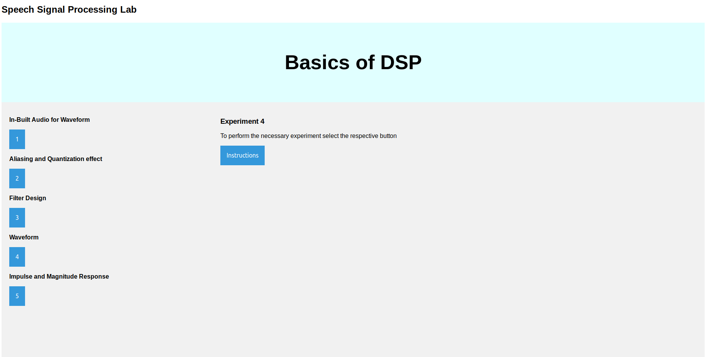
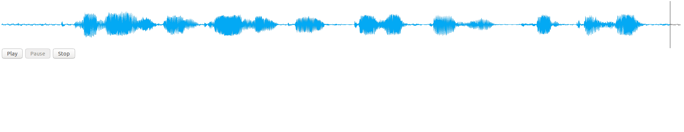
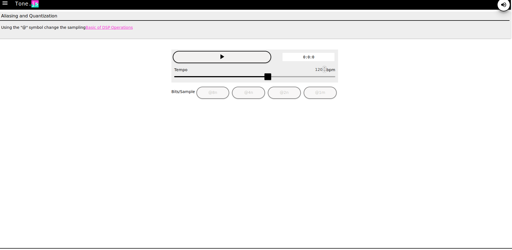
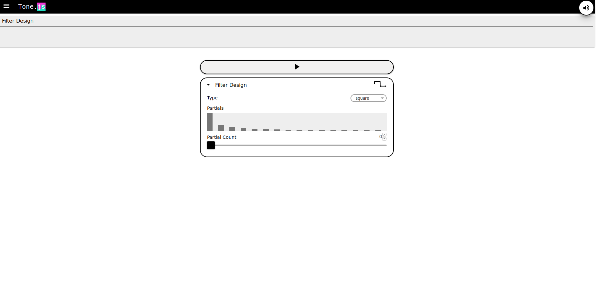
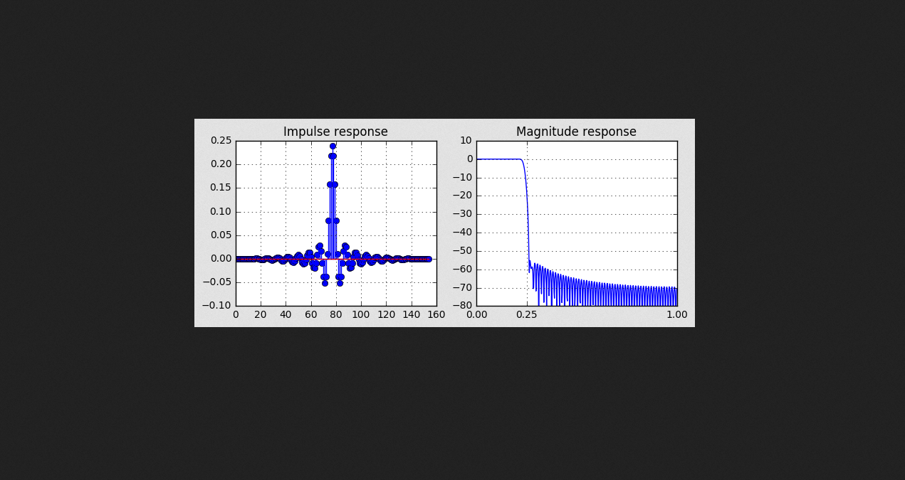

# Experiment Procedure Documentation
---
## Introduction
This document captures the instructions to run the simulation.

## Instructions
1. To start the experiment, open the "Index.html" file.

2. To run the experiment, click on the corresponding buttons provided in the Index.html page.

3.Click on the "Instructions" button for steps on installing required prerequisites to run the experiment.

4. After clicking the "1"button it will show the audio wave form.

5. After clicking the "2"button it will run the corresponding functionality.

6. After clicking the "3"button it will run the corresponding functionality.

7. After clicking the "4"button it will run the corresponding functionality.

8. After clicking the "5"button it will run the corresponding functionality.

9.The experiment overview is done.

